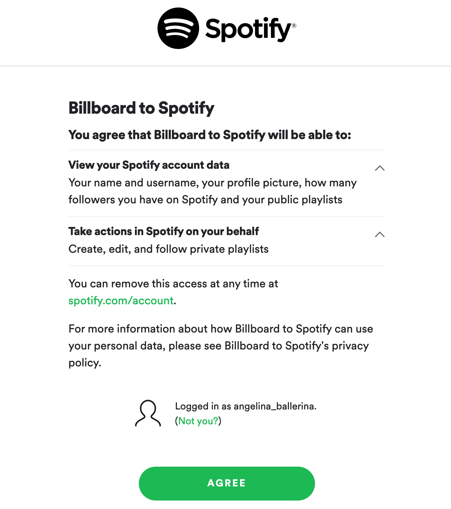
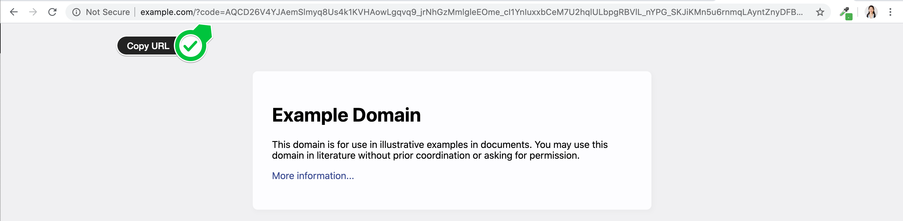
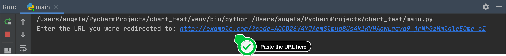
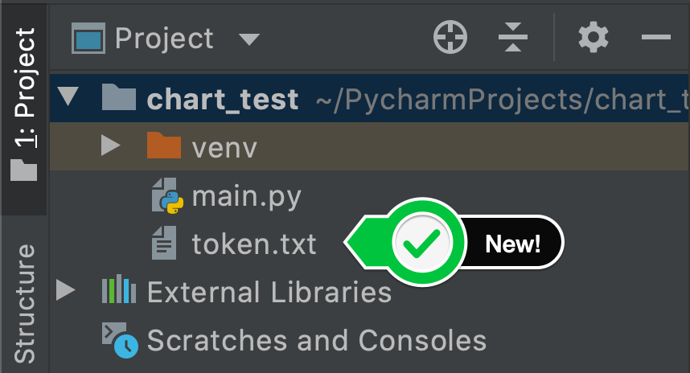

# Create Spotify Playlist using the Musical Time Machine

## Introduction
Uses Beautiful Soup to scrape the top 100 songs from a particular date of your choice.
- extracts all the song titles from the list
- uses the Spotify API to create a playlist for that particular date.
- search each of the songs on Spotify and add those songs to our new playlist.

In the end you will have a playlist that has the top 100 songs for a particular date in the past.

### APIs Used

- Billboard
https://www.billboard.com/charts/hot-100
- Spotify 
  - https://developer.spotify.com/documentation/web-api
  - https://developer.spotify.com/
- Spotipy
https://spotipy.readthedocs.io/en/2.22.1

### Spotipy
Spotipy is a lightweight Python library for the Spotify Web API. With Spotipy you get full access 
to all of the music data provided by the Spotify platform.

## Usage
- Install requests module and spotipy module
- Create app on the Spotify developer platform, and get the client id, client secret and
redirect uri.
- Run `main.py`

### Authentication with Spotify
If successful, you should see the page below show up automatically (be sure to click Agree):

Then it will take you to the page below, example.com and you need to copy the entire URL in the address bar:

Finally, you need to paste the URL into the prompt in PyCharm:

Now if you close PyCharm and restart, you should see a new file in this project called token.txt

